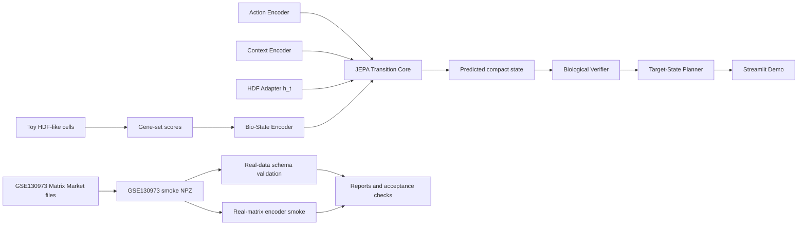

# HyCell-JEPA

HyCell-JEPA is a Universal-to-Specific cellular world model prototype for HDF aging, regeneration, and perturbation planning.

This repository is a v0.1 engineering MVP for AI4Science, AI drug discovery, AI product, and agent-engineering portfolio review. It demonstrates a runnable path from toy cellular perturbation data to compact latent transition modeling, biological overclaim checks, planning demos, real-data schema validation, GSE130973 real-matrix smoke ingestion/training, cloud workflow scaffolding, and reproducible verifier scripts.

Important: HyCell-JEPA v0.1 is not a validated biological discovery system, not clinical advice, not a complete virtual cell, not wet-lab validated, and not Lingshu-Cell-scale transcriptome diffusion.

## Problem

Cellular perturbation modeling often faces a practical tension:

- Full transcriptome generation is expensive, data-hungry, and hard to validate in a small MVP.
- Biological planning needs interpretable state transitions and explicit limits before any claim about interventions is safe.
- Real public single-cell matrices are useful for engineering validation, but metadata gaps make overclaiming easy.

HyCell-JEPA explores a smaller engineering question: can a project represent cell-state dynamics as transitions over compact biological belief states while keeping every workflow inspectable, testable, and honest about uncertainty?

Core transition idea:

```text
b_t + a_t + c_t + h_t -> b_{t+1}
```

Where `b_t` is a biological belief state, `a_t` is an intervention/action, `c_t` is context, and `h_t` is cell-system-specific adapter state.

## Why JEPA-Style Latent Transition

HyCell-JEPA uses compact latent transition modeling instead of full transcriptome generation because v0.1 prioritizes:

- Runnable local experiments over large GPU training.
- Inspectable biological readouts over high-dimensional black-box outputs.
- Verifier and planner plumbing over premature biological claims.
- Real-data smoke validation without inventing labels or transitions.

The current JEPA core predicts compact toy gene-set readouts, not full transcriptomes.

## Architecture



## Current Features

- Deterministic toy HDF-like perturbation data generator.
- Configured compact gene-set scoring.
- EvidenceGraph linking toy actions, readouts, assumptions, and limitations.
- Bio-State, Action, Context, and Adapter encoders.
- Compact NumPy JEPA transition core.
- HDF aging/regeneration adapter.
- Biological verifier with structured pass/warn/fail output.
- Target-state planner over toy action sequences.
- Streamlit demo.
- Real-data loaders for `.csv`, `.npz`, and optional `.h5ad`.
- AnnData-like schema validator.
- GSE130973 processed GEO Matrix Market ingestion.
- GSE130973 real-matrix evaluation and encoder smoke workflow.
- RTX 4090 cloud workflow scaffold and result packager.
- Goal-level and release-level verifier scripts.

## Quickstart

```bash
python -m venv .venv
# Windows PowerShell
.venv\Scripts\Activate.ps1
# macOS/Linux
source .venv/bin/activate

pip install -r requirements.txt
pytest
```

## Local Toy Workflow

```bash
python scripts/make_toy_data.py --config configs/toy_data.yaml
python scripts/score_gene_sets.py --input outputs/toy_data/toy_cells.csv --config configs/gene_sets.yaml
python scripts/build_evidence_graph.py --scores outputs/toy_data/gene_set_scores.csv
python scripts/train_encoder.py --config configs/train_local.yaml
python scripts/train_jepa.py --config configs/train_local.yaml
python scripts/eval_benchmark.py --checkpoint outputs/checkpoints/best_jepa.pt
python scripts/run_planner.py --checkpoint outputs/checkpoints/best_jepa.pt --state aged_hdf --target rejuvenated_repair
```

Example planner output from the toy smoke path:

```text
Top-K toy action sequences:
1. aging_stress -> regeneration | distance=0.458229
2. partial_reprogramming -> regeneration | distance=0.497030
3. control -> regeneration | distance=0.620774
```

Planner output is a software demonstration over toy compact states, not a therapy recommendation or protocol.

## Benchmark Smoke

```bash
python scripts/benchmark_toy.py --config configs/benchmark_toy.yaml
```

Example benchmark values from the accepted toy workflow:

```text
Toy score transitions: 8
Training transitions: 6
Held-out eval transitions: 2
All-transition MSE: 0.014585165
Verifier status counts: {"warn": 8}
Planner sequence: regeneration -> control
```

These metrics prove runnable engineering plumbing only. They do not validate biology.

## Real-Data GSE130973 Smoke Workflow

Download the processed GEO files manually and place them here:

```text
data/raw/gse130973/GSE130973_barcodes_filtered.tsv.gz
data/raw/gse130973/GSE130973_genes_filtered.tsv.gz
data/raw/gse130973/GSE130973_matrix_filtered.mtx.gz
```

Inspect, prepare, validate, summarize, and run the real-matrix smoke:

```bash
python scripts/inspect_gse130973.py --raw-dir data/raw/gse130973
python scripts/prepare_gse130973.py --raw-dir data/raw/gse130973 --out data/processed/gse130973/gse130973_smoke.npz --max-cells 5000 --max-genes 2000
python scripts/validate_dataset.py --input data/processed/gse130973/gse130973_smoke.npz
python scripts/eval_real_smoke.py --input data/processed/gse130973/gse130973_smoke.npz
python scripts/train_real_smoke.py --config configs/train_gse130973_smoke.yaml
```

Current real smoke behavior:

- Matrix orientation is handled as cells x genes in the processed artifact.
- The smoke NPZ is capped at 5000 cells x 2000 genes by default.
- `cell_system = skin_single_cell_unfiltered`.
- `state_label = unknown` and `age_label = unknown`.
- The file is not HDF-only or fibroblast-only.

## Cloud RTX 4090 Workflow

The cloud workflow is a reproducibility scaffold for a modest RTX 4090 instance. It does not download large real datasets automatically.

```bash
bash scripts/run_cloud_experiment.sh
python scripts/package_results.py --out outputs/hycell_cloud_results.zip
```

Useful Make targets:

```bash
make verify
make verify-release
make train-local
make train-cloud
make train-real-smoke
make package-results
```

## Streamlit Demo

```bash
streamlit run scripts/demo_app.py
```

The demo shows toy compact states, toy predicted transitions, verifier messages, and planner output. It is not an intervention recommendation interface.

## Reproducibility Checklist

```bash
pytest
bash scripts/verify_goal1.sh
bash scripts/verify_goal2.sh
bash scripts/verify_goal3.sh
bash scripts/verify_goal4.sh
bash scripts/verify_goal4_real_smoke.sh
bash scripts/verify_goal5.sh
bash scripts/verify_goal6.sh
bash scripts/verify_goal7.sh
bash scripts/verify_release.sh
```

Generated outputs live under ignored paths such as `outputs/` and `data/processed/`.

## Limitations

- Not clinical advice.
- Not wet-lab validated.
- Not a complete virtual cell.
- Not Lingshu-Cell-scale transcriptome diffusion.
- Toy data is engineering validation only.
- GSE130973 smoke workflows are real-matrix engineering validation only.
- Current GSE130973 smoke data has unknown age and state labels.
- Current GSE130973 smoke data is unfiltered human skin single-cell data, not HDF-only.
- Planner outputs are demonstrations, not therapy recommendations.

## Roadmap

- v0.1: engineering MVP and real-data smoke release.
- v0.2: GSE130973 metadata/cell-type annotation and documented HDF/fibroblast subset.
- v0.3: small scPerturb integration.
- v0.4: real perturbation benchmark.
- v0.5: stronger biological verifier and evidence grounding.
- v1.0: reproducible AI4LifeScience research prototype.

## Citation And Data Acknowledgement

GSE130973 is used as a public real-matrix smoke dataset:

Single-cell transcriptomes of the aging human skin reveal loss of fibroblast priming.

The repository does not redistribute the raw or processed GEO files. Users must download the processed supplementary files from GEO themselves and place them under `data/raw/gse130973/`.

## Release Verification

```bash
bash scripts/verify_release.sh
```

This command runs the test suite, Goal 1-7 verifiers, and release-document checks.
