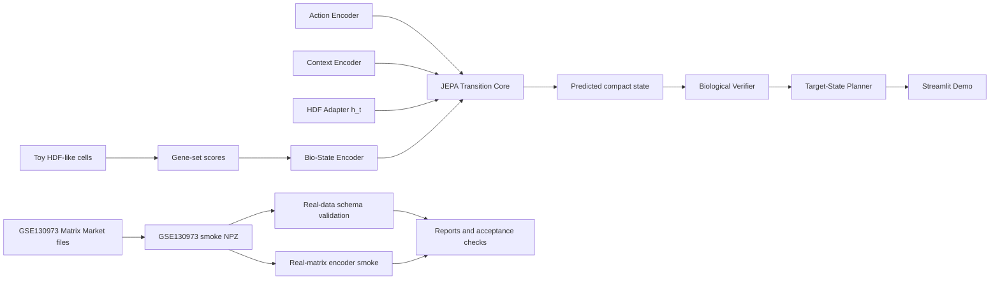

# HyCell-JEPA


HyCell-JEPA is a Universal-to-Specific cellular world model prototype for HDF aging, regeneration, and perturbation planning.

This repository is a v0.1 engineering MVP for AI4Science, AI drug discovery, AI product, and agent-engineering portfolio review. It demonstrates a runnable path from toy cellular perturbation data to compact latent transition modeling, biological overclaim checks, planning demos, real-data schema validation, GSE130973 real-matrix smoke ingestion/training, cloud workflow scaffolding, and reproducible verifier scripts.

Important: HyCell-JEPA v0.1 is not a validated biological discovery system, not clinical advice, not a complete virtual cell, not wet-lab validated, and not Lingshu-Cell-scale transcriptome diffusion.

## 30-Second Summary

HyCell-JEPA asks a focused engineering question: can a cellular world-model MVP represent interventions as transitions over compact, inspectable biological belief states while keeping verification, planning, real-data ingestion, and documentation honest enough for review?

In v0.1, the answer is a runnable local prototype:

- Toy HDF-like perturbation data flows through gene-set scoring, compact encoders, a JEPA-style transition core, verifier checks, planner search, benchmark reports, and a Streamlit demo.
- GSE130973 is used as a real single-cell matrix smoke workflow for ingestion, validation, summary, and lightweight encoder-style training, not for biological conclusions.
- Every release claim is backed by `pytest`, goal verifier scripts, and `scripts/verify_release.sh`.

## Limitations First

- Not clinical advice.
- Not wet-lab validated.
- Not a complete virtual cell.
- Not Lingshu-Cell-scale transcriptome diffusion.
- Toy data is engineering validation only.
- Planner outputs are demonstrations, not therapy recommendations.
- GSE130973 smoke workflows are real-matrix engineering validation only.
- Current GSE130973 smoke data is unfiltered human skin single-cell data, not HDF-only.
- Current GSE130973 smoke data has unknown age and state labels from the three GEO files alone.

## For Recruiters / Reviewers

Start here:

- `README.md` for the project story, commands, and limits.
- `docs/design_summary.md` for architecture and the universal-to-specific transition idea.
- `docs/model_card.md` for intended use, out-of-scope use, risks, and evaluation status.
- `scripts/verify_release.sh` for the reproducibility contract.
- Streamlit demo: `python -m streamlit run scripts/demo_app.py`.
- GSE130973 docs: `docs/gse130973_integration.md` and `docs/gse130973_smoke_report.md`.

## Problem

Cellular perturbation modeling often faces a practical tension:

- Full transcriptome generation is expensive, data-hungry, and hard to validate in a small MVP.
- Biological planning needs interpretable state transitions and explicit limits before any claim about interventions is safe.
- Real public single-cell matrices are useful for engineering validation, but metadata gaps make overclaiming easy.

HyCell-JEPA explores a smaller engineering question: can a project represent cell-state dynamics as transitions over compact biological belief states while keeping every workflow inspectable, testable, and honest about uncertainty?

Core transition idea:

```text
b_t + a_t + c_t + h_t -> b_{t+1}
```

Where `b_t` is a biological belief state, `a_t` is an intervention/action, `c_t` is context, and `h_t` is cell-system-specific adapter state.

## Why This Project Matters for AI4Science

AI4Science systems need more than a model checkpoint. They need data contracts, provenance-aware labels, explicit limits, reproducible commands, and guardrails against turning software smoke tests into biological claims.

HyCell-JEPA is built around that engineering discipline. The project keeps the model intentionally modest, then surrounds it with the pieces a larger cellular world-model effort would need: data loaders, schema checks, compact encoders, transition modeling, verifier outputs, planner reporting, demo UX, acceptance scripts, and living documentation.

## Relationship to Virtual Cell / Transcriptome Foundation Models

HyCell-JEPA is not a full virtual cell and does not generate whole transcriptomes. It is a small JEPA-style transition prototype over compact biological readouts.

The intended relationship is complementary:

- Virtual-cell and transcriptome foundation models aim at broad, high-dimensional cellular representation or generation.
- HyCell-JEPA v0.1 focuses on the engineering shell around cellular transition modeling: compact belief states, action/context/adapters, verifiers, planners, real-data smoke ingestion, and reproducibility contracts.
- Future versions could replace the toy compact state or encoder with stronger biological representations, but v0.1 deliberately avoids claiming foundation-model-scale capability.

## Why JEPA-Style Latent Transition

HyCell-JEPA uses compact latent transition modeling instead of full transcriptome generation because v0.1 prioritizes:

- Runnable local experiments over large GPU training.
- Inspectable biological readouts over high-dimensional black-box outputs.
- Verifier and planner plumbing over premature biological claims.
- Real-data smoke validation without inventing labels or transitions.

The current JEPA core predicts compact toy gene-set readouts, not full transcriptomes.

## Architecture



## What Works in v0.1

| Capability | Current status | What it proves |
| --- | --- | --- |
| Toy HDF-like data | Deterministic generator and tiny fixtures | File and workflow plumbing can run locally. |
| Compact readouts | Configured gene-set scoring | The MVP can operate on interpretable belief-state features. |
| EvidenceGraph | Links toy actions, readouts, assumptions, and limits | Claims and caveats can be represented explicitly. |
| Encoders | Bio-state, action, context, and adapter encoders | The transition interface can encode `b_t + a_t + c_t + h_t`. |
| JEPA transition core | Compact NumPy ridge-regression transition head | Next-state prediction plumbing works for toy compact states. |
| HDF adapter | Toy HDF aging/regeneration adapter | Cell-system-specific adapter routing is present. |
| Biological verifier | Structured pass/warn/fail output | Overclaim and sanity guardrails are part of the loop. |
| Target-state planner | Top-K toy action sequence search | Planning reports can be generated without presenting recommendations. |
| Streamlit demo | `scripts/demo_app.py` portfolio UI | Reviewers can inspect the toy loop and real-data smoke status interactively. |
| Real-data schema | `.csv`, `.npz`, optional `.h5ad` validation | Real candidate matrices can be checked without downloading data. |
| GSE130973 smoke workflow | Real single-cell matrix smoke ingestion/training | Unfiltered skin single-cell matrices can be inspected, prepared, validated, summarized, and projected. |
| Cloud scaffold | RTX 4090 config, run script, result packager | Cloud workflow shape exists without automatic large jobs. |
| Acceptance scripts | Goal 1-7 and release verifiers | The repository has reproducible completion contracts. |

## Quickstart

```bash
python -m venv .venv
# Windows PowerShell
.venv\Scripts\Activate.ps1
# macOS/Linux
source .venv/bin/activate

pip install -r requirements.txt
pytest
```

## Local Toy Workflow

```bash
python scripts/make_toy_data.py --config configs/toy_data.yaml
python scripts/score_gene_sets.py --input outputs/toy_data/toy_cells.csv --config configs/gene_sets.yaml
python scripts/build_evidence_graph.py --scores outputs/toy_data/gene_set_scores.csv
python scripts/train_encoder.py --config configs/train_local.yaml
python scripts/train_jepa.py --config configs/train_local.yaml
python scripts/eval_benchmark.py --checkpoint outputs/checkpoints/best_jepa.pt
python scripts/run_planner.py --checkpoint outputs/checkpoints/best_jepa.pt --state aged_hdf --target rejuvenated_repair
```

Example planner output from the toy smoke path:

```text
Top-K toy action sequences:
1. aging_stress -> regeneration | distance=0.458229
2. partial_reprogramming -> regeneration | distance=0.497030
3. control -> regeneration | distance=0.620774
```

Planner output is a software demonstration over toy compact states, not a therapy recommendation or protocol.

## Benchmark Smoke

```bash
python scripts/benchmark_toy.py --config configs/benchmark_toy.yaml
```

Example benchmark values from the accepted toy workflow:

```text
Toy score transitions: 8
Training transitions: 6
Held-out eval transitions: 2
All-transition MSE: 0.014585165
Verifier status counts: {"warn": 8}
Planner sequence: regeneration -> control
```

These metrics prove runnable engineering plumbing only. They do not validate biology.

## Real-Data GSE130973 Smoke Workflow

Download the processed GEO files manually and place them here:

```text
data/raw/gse130973/GSE130973_barcodes_filtered.tsv.gz
data/raw/gse130973/GSE130973_genes_filtered.tsv.gz
data/raw/gse130973/GSE130973_matrix_filtered.mtx.gz
```

Inspect, prepare, validate, summarize, and run the real-matrix smoke:

```bash
python scripts/inspect_gse130973.py --raw-dir data/raw/gse130973
python scripts/prepare_gse130973.py --raw-dir data/raw/gse130973 --out data/processed/gse130973/gse130973_smoke.npz --max-cells 5000 --max-genes 2000
python scripts/validate_dataset.py --input data/processed/gse130973/gse130973_smoke.npz
python scripts/eval_real_smoke.py --input data/processed/gse130973/gse130973_smoke.npz
python scripts/train_real_smoke.py --config configs/train_gse130973_smoke.yaml
```

Current real smoke behavior:

- Matrix orientation is handled as cells x genes in the processed artifact.
- The smoke NPZ is capped at 5000 cells x 2000 genes by default.
- This is a real single-cell matrix smoke workflow.
- The source is unfiltered human skin single-cell data.
- `cell_system = skin_single_cell_unfiltered`.
- `state_label = unknown` and `age_label = unknown` from the three GEO files alone.
- The file is not HDF-only or fibroblast-only.

## Cloud RTX 4090 Workflow

The cloud workflow is a reproducibility scaffold for a modest RTX 4090 instance. It does not download large real datasets automatically.

```bash
bash scripts/run_cloud_experiment.sh
python scripts/package_results.py --out outputs/hycell_cloud_results.zip
```

Useful Make targets:

```bash
make verify
make verify-release
make train-local
make train-cloud
make train-real-smoke
make package-results
```

## Streamlit Demo

```bash
python -m streamlit run scripts/demo_app.py
```

The demo shows toy compact states, toy predicted transitions, verifier messages, planner output, and GSE130973 smoke workflow status. It is not an intervention recommendation interface.

Screenshot placeholder: `docs/assets/demo_preview.png`

## Reproducibility Checklist

```bash
pytest
bash scripts/verify_goal1.sh
bash scripts/verify_goal2.sh
bash scripts/verify_goal3.sh
bash scripts/verify_goal4.sh
bash scripts/verify_goal4_real_smoke.sh
bash scripts/verify_goal5.sh
bash scripts/verify_goal6.sh
bash scripts/verify_goal7.sh
bash scripts/verify_release.sh
```

Generated outputs live under ignored paths such as `outputs/` and `data/processed/`.

## Roadmap

- v0.1: engineering MVP and real-data smoke release.
- v0.1.1: portfolio documentation and Streamlit demo polish.
- v0.2: GSE130973 metadata/cell-type annotation and documented HDF/fibroblast subset.
- v0.3: small scPerturb integration.
- v0.4: real perturbation benchmark.
- v0.5: stronger biological verifier and evidence grounding.
- v1.0: reproducible AI4LifeScience research prototype.

## Citation And Data Acknowledgement

GSE130973 is used as a public real-matrix smoke dataset:

Single-cell transcriptomes of the aging human skin reveal loss of fibroblast priming.

The repository does not redistribute the raw or processed GEO files. Users must download the processed supplementary files from GEO themselves and place them under `data/raw/gse130973/`.

## Release Verification

```bash
bash scripts/verify_release.sh
```

This command runs the test suite, Goal 1-7 verifiers, and release-document checks.
